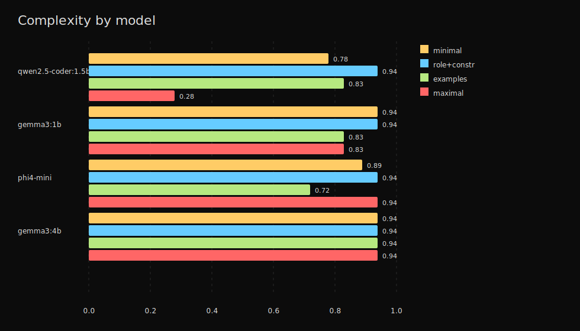

# Complexity Hurts Small Models

On qwen2.5-coder:1.5b, increasing prompt complexity from minimal to maximal dropped pass rate from 0.78 to 0.28.



## Key Numbers

| Model | minimal | role + constraints | examples | maximal |
|---|---:|---:|---:|---:|
| qwen2.5-coder:1.5b | 0.78 | 0.94 | 0.83 | 0.28 |
| gemma3:1b | 0.94 | 0.94 | 0.83 | 0.83 |
| phi4-mini:latest | 0.89 | 0.94 | 0.72 | 0.94 |
| gemma3:4b | 0.94 | 0.94 | 0.94 | 0.94 |

The strongest negative effect appears on the smallest coder model. Larger tested models were mostly flat.

## Public Runner

```bash
cd harness
uv run python validate.py e8 --model-name qwen2.5-coder:1.5b --k 3
```

The public `e8` command runs a comparable complexity sweep for the same finding class. Use it to test your own model or archive, and treat a fresh run as a related measurement rather than a byte-for-byte replay of the archived chart.

The published chart is derived from a local/private archived run, not from a checked-in raw experiment dump.

## Sample Counts

- 1 archived E8 run
- 4 models
- 4 prompt templates
- 96 scored calls

## Uncertainty Notes

This page reports point estimates from one archived run, not confidence intervals or multi-machine replications. Treat it as a directional capacity finding, not a stable universal ranking of prompt styles.

## Limitations

Complexity is represented as four discrete prompt templates, not a continuous scale. The result should be read as a capacity warning for small models, not a universal rule to make every prompt shorter.
