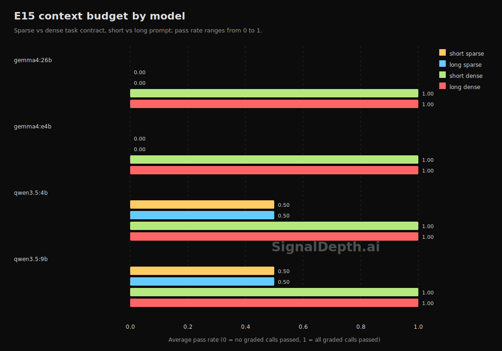

# Density Beats Length

Across four archived E15 runs, making sparse prompts longer did nothing. Making the task contract explicit raised average pass rate from 0.25 to 1.00.



## Key Numbers

| Condition | Average pass rate | Read |
|---|---:|---|
| short sparse | 0.25 | Short and underspecified |
| long sparse | 0.25 | More words, same missing contract |
| short dense | 1.00 | Short but explicit |
| long dense | 1.00 | Explicit and verbose |

The length marginal stayed flat at `0.625 -> 0.625`. The density marginal jumped from `0.25 -> 1.00`.

## Model Split

| Model | short sparse | long sparse | short dense | long dense |
|---|---:|---:|---:|---:|
| qwen3.5:4b | 0.50 | 0.50 | 1.00 | 1.00 |
| qwen3.5:9b | 0.50 | 0.50 | 1.00 | 1.00 |
| gemma4:e4b | 0.00 | 0.00 | 1.00 | 1.00 |
| gemma4:26b | 0.00 | 0.00 | 1.00 | 1.00 |

On this task family, both tested Qwen models were partly recoverable under sparse prompts, while both tested Gemma models collapsed until the contract became explicit.

## Failure Texture

Most sparse-prompt failures were contract-shape errors, not generic nonsense:

- `wrong_output_type`: 39
- `runtime_error`: 21
- `extraction_failure`: 12

The common pattern was straightforward: models wrote a plausible function for the task name, but returned the wrong output shape, printed instead of returning, or chose a familiar but wrong contract.

## Public Runner

```bash
cd harness
uv run python validate.py e15 --model-name qwen3.5:4b --k 3
```

The public `e15` command is source-complete for this finding class. Fresh runs should be read as replications on the same prompt family, not as a universal statement about context-window behavior.

## Data

- Aggregated finding: `data/public/findings.json`
- Task definitions: `harness/data.py`
- Harness: `harness/validate.py`

The raw E15 run archives stay local or private for now. The public repo publishes the derived summary, plotting code, and runnable harness.

## Sample Counts

- 4 archived E15 run files
- 4 models
- 4 tasks
- 16 task-model rows per condition
- 192 total graded calls
- `k=3` per condition

## Limitations

This result comes from deterministic Python code tasks on four local-model runs. It separates prompt length from prompt explicitness inside this task family; it does not show that context window never matters for retrieval, long-document synthesis, or multi-turn chat.
