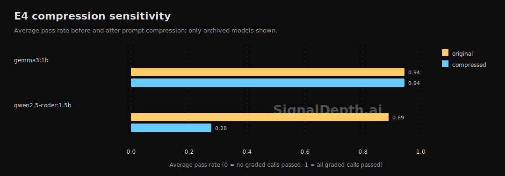

# Filler Words Are Load-Bearing

On qwen2.5-coder:1.5b, compressing verbose prompts dropped average pass rate from roughly 0.89 to 0.28 across the archived compression experiment.

## Key Numbers

| Model | Original | Compressed | Direction |
|---|---:|---:|---|
| qcoder | 0.89 | 0.28 | Compression hurt |
| gemma1b | 0.94 | 0.78 | Compression hurt less |

The destructive cases were not whitespace cleanup. They came from phrase simplification and filler deletion, where wording that looks redundant to humans appears to help small models keep task structure.

## Reproduce

The public repo ships the derived summary in `data/public/findings.json`. The contribution harness currently supports E9 first; E4 reproduction commands will be promoted after the harness migration is complete.

## Limitations

This finding is model-dependent. It should not be summarized as "compression hurts" or "compression helps" without naming the model size and task family.
