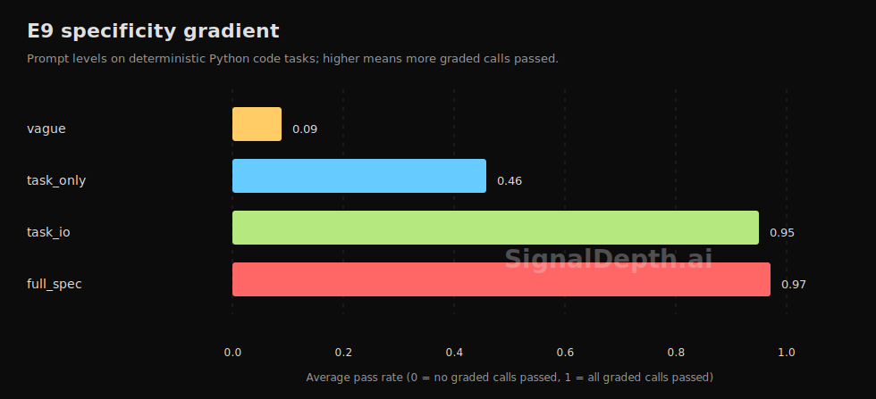

# Specificity Dwarfs Everything

On 1-4B local models, moving a prompt from vague to task plus input/output spec raised average pass rate from 8% to 82%.



## Key Numbers

| Prompt level | Average pass rate | Notes |
|---|---:|---|
| vague | 0.08 | Task name only |
| task_only | 0.38 | The task is stated, but shape is missing |
| task_io | 0.82 | Input/output shape and one example |
| full_spec | 0.83 | Adds constraints and edge cases |

The jump from task_only to task_io is the cliff. More detail after that helps much less on the current task set.

## Reproduce

```bash
cd harness
uv run python validate.py e9 --model-name qwen2.5-coder:1.5b --k 3
```

## Data

- Public fixture: `data/examples/e9_specificity_fixture.json`
- Aggregated finding: `data/public/findings.json`
- Task definitions: `harness/data.py`

The full raw run archive for this finding is curated privately.

## Limitations

The task set is deterministic Python coding tasks. This finding does not claim the same effect size for open-ended writing, long-context retrieval, or multi-turn conversations.
